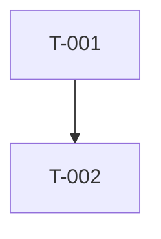

````md
# PLAN: [workstream — goal title]

## Goal

[Clear explanation of what the change accomplishes and why]

- **Success criteria**: [Measurable success criteria]

## Assumptions

- **Assumption**: [assumption]
- **Out of scope**: [excluded item]

## Task graph


````

- T-001: [title]
- T-002: [title] — depends on T-001

## Tasks

### T-001: [Task title]

- **Dependencies**: [none | T-00N, T-00M]
- **Context**: [Target files, current behavior, and seams]
- **Scope**:
  - [Atomic change 1]
  - [Atomic change 2]
- **Acceptance**:
  - [Observable outcome 1]
  - [Observable outcome 2]
- **Verification**:
  - `[command or check]`

## Risk notes

- [Risk, data loss potential, or fallback path]

## Source audit notes

- [file path, seam, or test file]

```

```
