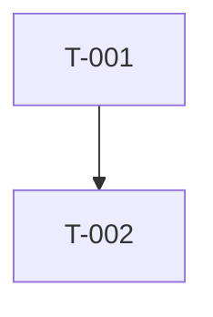

````md
# PLAN: [workstream—goal title]

## Goal

[Clear explanation of what the change accomplishes and why]

- **Success criteria**: [Measurable success criteria]

## Assumptions

- **Assumption**: [assumption]
- **Out of scope**: [excluded item—note: git staging, commits, tags, and
  releases lie strictly outside the plan]

## Task graph


```mermaid
flowchart TD
  T01[T-001] --> T02[T-002]
```

- T-001: [title]
- T-002: [title] (depends on T-001)

## Tasks

### T-001: [Task title]

- **Dependencies**: [none | T-00N, T-00M]
- **Satisfies**: [Every R-NNN its Acceptance implements, for example R-001,
  R-003 | none (enabling task, see Context)]
- **Intent**: [One line: the goal this task serves and why it matters]
- **Context**: [Entry-point paths, plus facts a fresh agent can't derive,
  including facts surfaced only while planning this task]
  - [Task-bound exclusion: settled rejection, residual risk, or members a closed
    line leaves unnamed, bounding this task's outcomes—if applicable]
- **Scope**:
  - [Change surface—module, behavior, or contract—including direct dependents
    the change breaks; never an edit list]
  - [Non-obvious off-limits area—if applicable]
- **Acceptance**:
  - [Observable outcome or contract under valid inputs]
  - [Preserved behavior at risk—if applicable]
  - [Failure mode / Edge case—if SPEC.md names it or the task's own change
    introduces it]
- **Verification**:
  - `[project command or existing test target]`—[outcomes it proves]
  - `[build or lint command]`—[outcomes it proves]
- **Guidance** (advisory—omit when obvious; omit any absent kind):
  - **Pattern**: [`path:line` (`symbol`)—existing exemplar to mirror]
  - **Solution**: [Recommended solution sketch naming key sites and steps]
  - **Avoid**: [Tempting wrong approach—its defect]
  - **Tests**: [Test file to extend, fixtures to reuse, notable cases]

## Risk notes

- [Risk or data loss potential]
- [Residual risk carried from `SPEC.md`]
````
